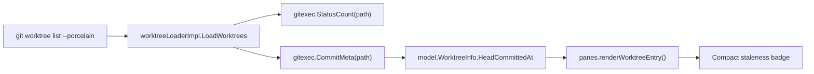
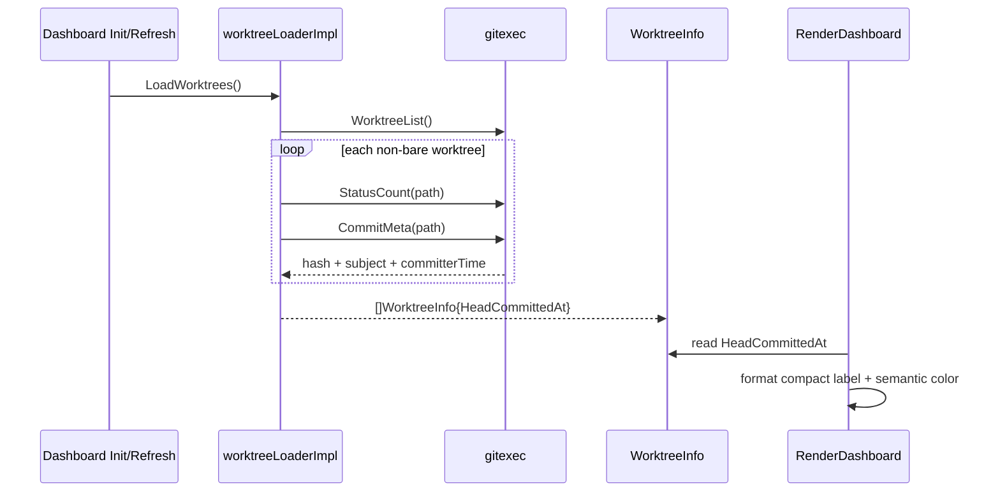

# Worktree Staleness Indicator Design

> **Specification:** [SPEC.md](./SPEC.md)

## Architecture Overview

This feature keeps the current dashboard pipeline and swaps the source of the visible "age" signal. The git layer returns HEAD commit metadata including committer time, the loader stores that raw timestamp on `WorktreeInfo`, and the dashboard pane formats it into a compact color-coded badge. Runtime `LastActivityAt` remains an internal refresh-tracking signal and is not repurposed as git staleness.



## Existing Standards

| Pattern | Location | How It Applies |
|---------|----------|----------------|
| Worktree dashboard data is assembled in the app layer, not in the pane | `internal/app/bootstrap.go:221-263` | Staleness metadata should be loaded in `worktreeLoaderImpl.LoadWorktrees`, then passed into the UI model. |
| Dashboard rows are rendered from raw `WorktreeInfo` in the pane layer | `internal/ui/panes/dashboard.go:22-95` | The staleness badge should be derived at render time from a model timestamp, alongside the existing count/branch/basename layout. |
| Runtime dashboard activity is reconciled in the UI model | `internal/ui/dashboard.go:471-497` | `LastActivityAt` should remain this runtime signal; do not overload it with git commit age. |
| Git subprocesses are isolated in `gitexec` helpers | `internal/gitexec/worktree.go:18-104` | Commit timestamp lookup should extend the existing gitexec commit helper instead of shelling out from the loader. |
| Dashboard colors use semantic ANSI tokens from theme | `internal/ui/theme/theme.go:15-25` | The badge should reuse `theme.Clean`, `theme.Dirty`, `theme.Error`, and `theme.Muted` rather than new custom colors. |

**Why these standards:** They keep git command parsing centralized, preserve the app/model/pane boundary already used by the dashboard, and avoid ad hoc color logic that would drift from the rest of the TUI.

## File Structure

```text
internal/
├── app/
│   └── bootstrap.go              # Modify: populate commit age in WorktreeInfo
├── gitexec/
│   ├── worktree.go               # Modify: return commit timestamp with hash + subject
│   └── worktree_test.go          # Modify/Create: parser coverage
├── model/
│   └── worktree.go               # Modify: add raw commit timestamp field
└── ui/
    ├── dashboard.go              # Modify: preserve runtime activity semantics
    └── panes/
        ├── dashboard.go          # Modify: render staleness badge
        └── dashboard_test.go     # Modify: staleness formatting/render coverage
```

**Legend:** `Modify` = edit existing file, `Create` = add new test file only if no existing fit is clean.

## Naming Conventions

| Entity | Pattern | Example |
|--------|---------|---------|
| Raw git timestamp field | `Head*At` | `HeadCommittedAt` |
| Git metadata helper | noun phrase | `CommitMeta` |
| UI formatter | `format*` / `style*` helper | `formatStaleness()` |

## Data Flow



## Data Transformation Points

| Layer Boundary | Code Path | Function | Input → Output | Location |
|----------------|-----------|----------|----------------|----------|
| Git output → parsed commit metadata | Shared | `CommitMeta()` | `git log -1 --format=...` text → `hash + subject + committer time` | `internal/gitexec/worktree.go:79-89` |
| Loader aggregation → dashboard model | Dashboard bootstrap/refresh | `worktreeLoaderImpl.LoadWorktrees()` | `WorktreeEntry + status count + commit meta` → `model.WorktreeInfo` | `internal/app/bootstrap.go:226-259` |
| Dashboard model → visible badge | Dashboard list render | `renderWorktreeEntry()` + staleness helper | `HeadCommittedAt` → compact label + style | `internal/ui/panes/dashboard.go:46-90` |
| Snapshot reconciliation | Dashboard refresh | `reconcileActivity()` | old/new `WorktreeInfo` → preserved runtime `LastActivityAt` | `internal/ui/dashboard.go:471-497` |

## Integration Points

| Point | Existing Code | New Code Interaction |
|-------|---------------|----------------------|
| Worktree model shape | `internal/model/worktree.go:5-15` | Add raw commit timestamp field for dashboard use. |
| Loader commit lookup | `internal/app/bootstrap.go:252-257` | Swap from hash/subject-only helper to helper that also returns committer time. |
| Dashboard row layout | `internal/ui/panes/dashboard.go:72-90` | Replace runtime `RelativeTime(wt.LastActivityAt)` column with staleness badge rendering. |
| Refresh behavior | `internal/ui/dashboard.go:490-495` | Leave runtime activity updates keyed to dirty/count/commit changes only. |

## API Contracts

```text
WorktreeInfo
- Path string
- Branch string
- CommitHash string
- Subject string
- HeadCommittedAt time.Time   // new
- Dirty bool
- Bare bool
- ChangedFiles int
- LastActivityAt time.Time
```

```text
CommitMeta
- Hash string
- Subject string
- CommitDate time.Time
```

## Design Decisions

| Decision | Rationale | Alternatives Considered |
|----------|-----------|-------------------------|
| Use HEAD committer date as the staleness source | It is available in the existing `git log -1` path and directly answers "how old is this branch tip?" without new repository-wide queries. | `main..branch` age or merge-status checks were rejected for v1 because they need extra base-branch policy and more git work. |
| Replace the visible runtime activity column | The current `LastActivityAt` is session-local and misleading as a delete heuristic; keeping both signals would overcrowd the fixed-width row. | Adding a second column was rejected for width pressure in the dashboard layout. |
| Keep `LastActivityAt` in the model | It is already used by snapshot reconciliation and should remain the refresh signal even if it is no longer rendered. | Reusing `LastActivityAt` for git age was rejected because it would break existing refresh semantics and tests. |
| Parse commit metadata with a delimiter-safe format | Adding a timestamp makes space-splitting brittle; using a sentinel delimiter keeps subject parsing robust. | Extending the current `%h %s` parsing with more spaces was rejected as fragile. |

## External Dependencies

- `git log -1 --format=%h%x00%cI%x00%s` (or equivalent delimiter-safe format) from the existing git boundary
- No new third-party libraries
